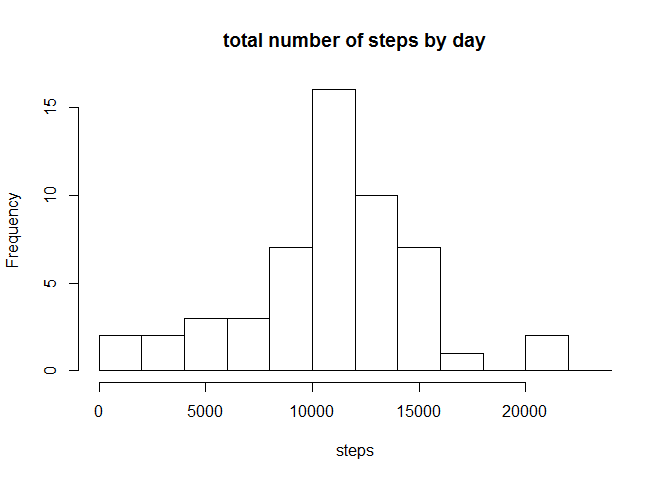
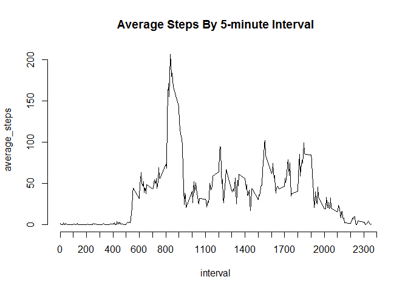
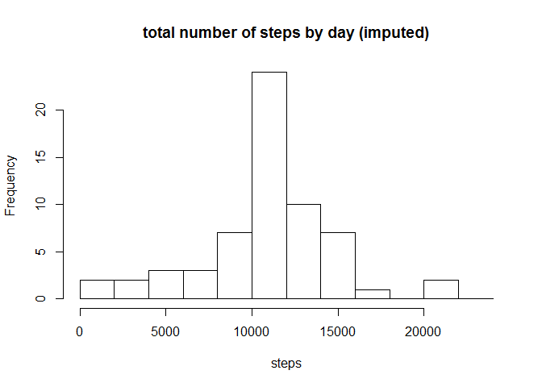
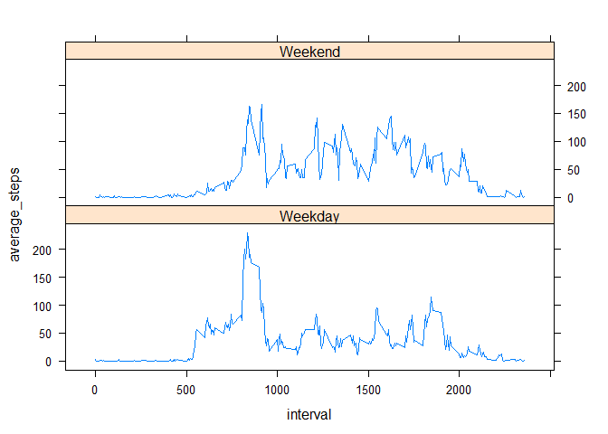

# Reproducible Research: Peer Assessment 1

## Prerequisite
* To run this R markdown script, you need to store the __activity.csv__ in the same directory.
* This script requires __dplyr__ and __lattice__ package.

```r
library(dplyr)
library(lattice)

file_name <- "activity.csv"

# save the original locale
LC_TIME_ori <- Sys.getlocale("LC_TIME")
Sys.setlocale("LC_TIME", "English")
```


## Loading and preprocessing the data

### 1. Load the data.

```r
df_data_ori <- read.csv(file_name)
```

### 2. Process/transform the data into a format suitable for the analysis.

```r
# Actually, we do nothing here, but saving the original date just in case.
df_data <- df_data_ori
```


## What is mean total number of steps taken per day?

### 1\. Calculate the total number of steps taken per day

```r
df_total_steps_by_day <- df_data %>%
  group_by(date) %>%
  summarise(total_steps = sum(steps))
```

### 2\. Make a histogram of the total number of steps taken each day

```r
hist(df_total_steps_by_day$total_steps, breaks=seq(0, 25000, 2000), main = "total number of steps by day", xlab = "steps")
```

 

### 3-1. Calculate mean total number of steps taken per day

```r
(mean_steps_per_day <- mean(df_total_steps_by_day$total_steps, na.rm = TRUE))
```

```
## [1] 10766.19
```

### 3-2. Calculate median total number of steps taken per day

```r
(median_steps_per_day <- median(df_total_steps_by_day$total_steps, na.rm = TRUE))
```

```
## [1] 10765
```


## What is the average daily activity pattern?

### 1\. Make a time series plot of the 5-minute interval (x-axis) and the average number of steps taken, averaged across all days (y-axis)

```r
df_average_steps_by_interval <- df_data %>%
  group_by(interval) %>%
  summarise(average_steps = mean(steps, na.rm = TRUE))

with(df_average_steps_by_interval, plot(interval, average_steps, type = "l", axes = FALSE))
title(main = "Average Steps By 5-minute Interval")
axis(side=1, at = seq(0, 2400, by=100))
axis(side=2, at = seq(0, max(df_average_steps_by_interval$average_steps), by = 50))
```

 

### 2\. Which 5-minute interval, on average across all the days in the dataset, contains the maximum number of steps?

```r
(df_average_steps_by_interval[df_average_steps_by_interval$average_steps == max(df_average_steps_by_interval$average_steps), ]$interval)
```

```
## [1] 835
```


## Imputing missing values

### 1\. Calculate and report the total number of missing values in the dataset (i.e. the total number of rows with NAs)

```r
(nrow(df_data[is.na(df_data$steps), ]))
```

```
## [1] 2304
```

### 2 & 3. Devise a strategy for filling in all of the missing values in the dataset. The strategy does not need to be sophisticated and create a new dataset that is equal to the original dataset but with the missing data filled in.

```r
# use the mean for that 5-minute interval
df_data_imputed <- df_data
for (i in seq_along(df_data_imputed$steps)) {
  if(is.na(df_data_imputed[i, "steps"])) {
    df_data_imputed[i, "steps"] <- round(df_average_steps_by_interval[df_average_steps_by_interval$interval == df_data_imputed[i, "interval"], "average_steps"])
  }
}
```

### 4-1. Make a histogram of the total number of steps taken each day

```r
df_total_steps_by_day_imputed <- df_data_imputed %>%
  group_by(date) %>%
  summarise(total_steps = sum(steps))

hist(df_total_steps_by_day_imputed$total_steps, breaks=seq(0, 25000, 2000), main = "total number of steps by day (imputed)", xlab = "steps")
```

 

Display the histogram from the first part of the assignment again for comparison (re-posted).
 

### 4-2. calculate the mean total number of steps taken per day.

```r
(mean_steps_per_day_imputed <- mean(df_total_steps_by_day_imputed$total_steps, na.rm = TRUE))
```

```
## [1] 10765.64
```

### 4-3. calculate the median total number of steps taken per day.

```r
(median_steps_per_day_imputed <- median(df_total_steps_by_day_imputed$total_steps, na.rm = TRUE))
```

```
## [1] 10762
```

### 4-4. show the comparison

|  |      mean |           median |  
| ------ | ------- | ------ |  
| original (A) |     1.0766189\times 10^{4} |     10765 |  
| imputed  (B) |     1.0765639\times 10^{4} |     1.0762\times 10^{4} |  
| diff (B - A) |     -0.549335 |     -3 |  


## Are there differences in activity patterns between weekdays and weekends?

### 1\. Create a new factor variable in the dataset with two levels --- ?gweekday?h and ?gweekend?h indicating whether a given date is a weekday or weekend day.

```r
df_data_imputed <- df_data_imputed %>%
  mutate(day_of_week = weekdays(as.Date(date))) %>%
  mutate(weekday = factor(ifelse(day_of_week == "Saturday" | day_of_week == "Sunday", "Weekend", "Weekday"), levels = c("Weekday", "Weekend")))
```

### 2\. Make a panel plot containing a time series plot (i.e. type = "l") of the 5-minute interval (x-axis) and the average number of steps taken, averaged across all weekday days or weekend days (y-axis).

```r
df_average_steps_by_interval_by_weekday <- df_data_imputed %>%
  group_by(interval, weekday) %>%
  summarise(average_steps = mean(steps, na.rm = TRUE))

xyplot(average_steps ~ interval | weekday, df_average_steps_by_interval_by_weekday, type = "l", layout = (c(1,2)))
```

 
